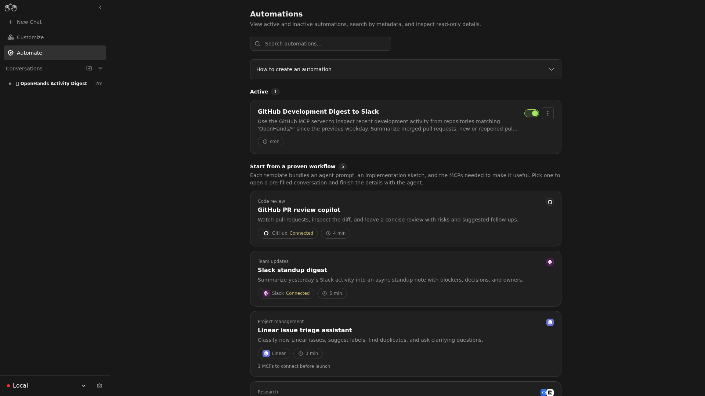

<!--
Copyright Advanced Micro Devices, Inc.

SPDX-License-Identifier: MIT
-->

<!-- @github-only -->
> [!IMPORTANT]
> This playbook uses AMD Playbooks comment tags that are interpreted by the
> AMD Playbooks site. GitHub renders the Markdown content, but not the device,
> OS, variable, or hidden-test directives.
<!-- @github-only:end -->

# Build a GitHub-to-Slack Development Digest with Agent Canvas and Lemonade

## Overview

In this playbook, you will run a local LLM with Lemonade Server, connect Agent
Canvas to that local OpenAI-compatible endpoint, and create an automation that
summarizes recent GitHub development activity into a Slack digest.

The workflow is intentionally local-first:

1. Lemonade Server hosts the model on your AMD system.
2. Agent Canvas uses that model through the same `/api/v1` OpenAI-compatible
   interface that cloud LLM clients use.
3. OpenHands Automations runs a scheduled task that reads GitHub activity and
   posts a short summary to Slack through MCP servers.

This gives you a private daily or weekly engineering update without sending the
model prompt or repository summary to a hosted LLM provider.

<!-- @device:stx,krk -->
> [!NOTE]
> A coding-agent workflow benefits from a larger model and a larger context
> window. Use at least 32 GB of system memory, and prefer 64 GB or more for
> larger Qwen, GPT-OSS, or similar GGUF models.
<!-- @device:end -->

## What You'll Learn

- How to start and verify Lemonade Server as a local LLM endpoint.
- How to configure Agent Canvas through its onboarding flow.
- How to install GitHub and Slack MCP servers.
- How to create a scheduled automation with the prompt preset API.
- How to test the automation and tune the Slack digest format.

## Architecture

```text
GitHub repos  --->  GitHub MCP  ----+
                                    |
                                    v
                              OpenHands automation
                                    |
                                    v
Lemonade Server  <--- Agent Server / Agent Canvas ---> Slack MCP ---> Slack channel
```

The automation itself is created from a natural-language prompt. The prompt
defines the GitHub scope, reporting cadence, Slack destination, and output
format. The prompt preset endpoint handles the automation boilerplate for you.

## Prerequisites

<!-- @os:linux -->
<!-- @require:lemonade,nodejs -->
<!-- @os:end -->

<!-- @os:windows -->
<!-- @require:lemonade,nodejs -->
<!-- @os:end -->

You also need:

- A GitHub personal access token with read access to the repositories you want
  summarized. If the automation will comment or create issues, add only the
  specific write permissions it needs.
- A Slack app bot token that starts with `xoxb-`.
- A Slack workspace/team ID that starts with `T`.
- A Slack channel ID where the digest should be posted. Channel names work in
  small workspaces, but channel IDs are more reliable and avoid forcing the
  agent to enumerate every channel.
- Agent Canvas running with the automation stack enabled.

For the Slack MCP server, the common bot token scopes are:

- `channels:read`
- `chat:write`
- `users:read`
- `users.profile:read`

If the bot is not already a member of the target public channel, either invite
it with `/invite @YOUR_APP_NAME` in Slack or add `channels:join` so it can join
that channel programmatically. If you want to summarize or post into private
Slack channels, add the corresponding private-channel scopes, such as
`groups:read` and `groups:history`, and invite the Slack app to those channels.
For a GitHub-only development digest, the automation does not need to read Slack
history; Slack is only the reporting destination.

## Variables Used in This Playbook

<!-- @device:halo,halo_box,stx,krk -->
<!-- @var:id=lemonade_model value="Qwen3.6-35B-A3B-GGUF" -->
<!-- @device:end -->

```bash
export LEMONADE_BASE_URL="http://127.0.0.1:13305/api/v1"
export LEMONADE_MODEL="Qwen3.6-35B-A3B-GGUF"
export AGENT_CANVAS_URL="http://localhost:8000"
export AUTOMATION_API_URL="http://localhost:8000/api/automation"
export GITHUB_REPO_FILTER="your-org/your-repo"
export SLACK_DIGEST_CHANNEL="C0123456789"
export DIGEST_TIMEZONE="America/New_York"
```

Prefer an explicit `owner/repo` or a short, bounded list of repositories for
local Lemonade-backed runs. Broad organization wildcards can return too much
MCP context for smaller local model context windows.


For a remote OpenHands or cloud automation environment, replace
`LEMONADE_BASE_URL` with a reachable HTTPS tunnel URL, for example:

```bash
export LEMONADE_BASE_URL="https://YOUR_NGROK_DOMAIN.ngrok-free.dev/api/v1"
```

The current local development setup this playbook was modeled from serves
Lemonade on `127.0.0.1:13305`, with the loaded model
`Qwen3.6-35B-A3B-GGUF`, a llama.cpp Vulkan backend, and a 65,536-token context.

## 1. Start Lemonade Server

If Lemonade is already installed, start a model from the Lemonade CLI:

```bash
lemonade config set llamacpp.backend=vulkan
lemonade config set ctx_size=65536
lemonade run "${LEMONADE_MODEL}"
```

If you are developing Lemonade from a local source checkout, you can run the
server binary directly:

```bash
cd ~/work/lemonade
build/lemond --host 127.0.0.1 --port 13305
```

Lemonade exposes an OpenAI-compatible API at:

```text
http://127.0.0.1:13305/api/v1
```

Optional: if Agent Canvas or the automation runner is not on the same machine,
publish the Lemonade endpoint through a secure tunnel:

```bash
ngrok http 13305 --url YOUR_NGROK_DOMAIN.ngrok-free.dev
```

Use the HTTPS tunnel URL as the Agent Canvas LLM base URL in later steps.

<!-- @test:id=lemonade-version timeout=60 hidden=True -->
```bash
lemonade --version
```
<!-- @test:end -->

<!-- @test:id=lemonade-health-linux timeout=120 hidden=True -->
```bash
set -euo pipefail

for i in $(seq 1 120); do
  if curl -fsS "http://127.0.0.1:13305/api/v1/health" >/dev/null; then
    echo "OK: Lemonade Server is responding"
    exit 0
  fi
  sleep 1
done

echo "Lemonade Server did not become ready on http://127.0.0.1:13305"
exit 1
```
<!-- @test:end -->

## 2. Verify the Local Model

List Lemonade models and confirm the selected model is downloaded:

```bash
curl -s "${LEMONADE_BASE_URL}/models" | python3 -m json.tool
```

You should see an entry like:

```json
{
  "id": "Qwen3.6-35B-A3B-GGUF",
  "downloaded": true,
  "recipe": "llamacpp"
}
```

Send a quick chat completion request:

```bash
curl -sS "${LEMONADE_BASE_URL}/chat/completions" \
  -H "Content-Type: application/json" \
  -d '{
    "model": "'"${LEMONADE_MODEL}"'",
    "messages": [
      {"role": "user", "content": "Reply with exactly: OK"}
    ],
    "temperature": 0,
    "max_tokens": 64
  }' | python3 -m json.tool
```

If this returns a `choices` array, Lemonade is ready for Agent Canvas.

## 3. Start Agent Canvas with Automations

From the Agent Canvas checkout:

```bash
cd ~/work/agent-canvas
npm ci
npm run dev
```

For a static production-style frontend, use:

```bash
npm run dev:static
```

Both launchers start:

- Agent Server on port `18000`
- Automation backend on port `18001`
- Frontend on port `3001`
- Ingress proxy on port `8000`

Open Agent Canvas in your browser:

```text
http://localhost:8000
```

## 4. Complete the Onboarding Flow

Agent Canvas shows a four-step onboarding modal for first-time users.

### Choose Agent

Select **OpenHands**. This route uses the Agent Server LLM configuration you
will point at Lemonade. The other agent choices are ACP subprocess agents and
manage their own model settings.


### Check Backend

Confirm the local Agent Server is connected. If you used the default launcher,
the backend should be reachable through the ingress at:

```text
http://localhost:8000
```

Click **Next** only after the connection banner reports success.


### Set Up LLM

Open the advanced or all-settings view in the LLM step and use:

| Field | Value |
| --- | --- |
| Custom model | `openai/Qwen3.6-35B-A3B-GGUF` |
| Base URL | `http://127.0.0.1:13305/api/v1` |
| API key | `lemonade` for an unauthenticated local server, or the value of `LEMONADE_API_KEY` if your Lemonade endpoint requires a key |

The onboarding form may be pre-filled with a hosted model. Replace that model
with the `openai/...` Lemonade model in the advanced view before clicking
**Next**.

Why the `openai/` prefix? Agent Canvas talks to local OpenAI-compatible
servers through LiteLLM. The prefix tells LiteLLM to use OpenAI-compatible
request formatting, while the base URL redirects the request to Lemonade.

If Agent Server cannot reach `127.0.0.1:13305`, use your tunnel URL instead:

```text
https://YOUR_NGROK_DOMAIN.ngrok-free.dev/api/v1
```

Click **Next** to save the LLM profile.


### Say Hello

Send the default hello message or continue directly to the recommended
automation cards. The final onboarding step also contains recommended
automations; for this playbook, you will create a custom GitHub-to-Slack digest
in the next sections.


## 5. Install GitHub and Slack MCP Servers

Agent Canvas uses MCP servers to let the automation read GitHub and post to
Slack. Open the MCP directory:

```text
http://localhost:8000/mcp
```

Install **GitHub** and **Slack** from the marketplace when possible. The
marketplace cards may use the current recommended commands, such as the GitHub
MCP Docker image or a maintained Slack MCP package.

If you prefer a no-Docker custom setup, click **Add custom server** and add
these stdio servers:

| Server | Field | Value |
| --- | --- | --- |
| GitHub | Command | `npx` |
| GitHub | Arguments | `-y @modelcontextprotocol/server-github` |
| GitHub | Environment | `GITHUB_PERSONAL_ACCESS_TOKEN=YOUR_GITHUB_TOKEN` |
| Slack | Command | `npx` |
| Slack | Arguments | `-y @modelcontextprotocol/server-slack` |
| Slack | Environment | `SLACK_BOT_TOKEN=xoxb-...` |
| Slack | Environment | `SLACK_TEAM_ID=T...` |
| Slack | Environment | `SLACK_CHANNEL_IDS=C0123456789` |

`SLACK_CHANNEL_IDS` is optional for the Slack MCP server, but it is strongly
recommended for this playbook. It limits channel listing to the digest channel
and prevents the agent from paging through a large Slack workspace just to find
where to post.


After installing the Slack server, invite the Slack app to the channel where
you want the digest posted.

## 6. Create the GitHub-to-Slack Digest Automation

Open a new Agent Canvas conversation and paste the prompt below. Replace the
placeholder values before sending.

When creating the automation from an Agent Canvas conversation, the agent sees a
`<RUNTIME_SERVICES>` block that lists the automation backend URL. Trust that
block instead of guessing ports; the Agent Server and the Automation backend are
different services.

```text
Create a scheduled OpenHands automation named "GitHub Development Digest to Slack".

Use the local OpenHands Automations prompt preset endpoint. Read the automation
backend URL from the <RUNTIME_SERVICES> block, and use the /api/automation/v1/preset/prompt
path on that backend. The automation should:

1. Run every weekday at 9:00 AM in America/New_York.
2. Use the GitHub MCP server to inspect recent development activity from repositories matching "your-org/your-repo". Prefer explicit repositories or a short bounded list over broad organization wildcards when using a local Lemonade model.
3. Summarize activity from the previous weekday, including:
   - merged pull requests
   - newly opened or reopened pull requests
   - notable commits pushed to main or release branches
   - new issues and high-priority issue updates
   - releases or tags
   - risks, blockers, and review requests that need attention
4. Use the Slack MCP server to post the digest to channel ID C0123456789.
5. Keep the Slack post concise:
   - title with date range
   - 3 to 7 bullets of meaningful changes
   - "Needs attention" section only when there are blockers
   - links back to GitHub PRs, issues, commits, and releases
6. Include this note at the end: "This digest was generated by an AI agent (OpenHands) on behalf of the user."
7. Do not include secrets, raw tokens, private environment variables, or unrelated Slack messages.
8. If GitHub returns too much activity, prioritize merged PRs, releases, and items labeled bug, security, release, or blocker.

Use this trigger:
{
  "type": "cron",
  "schedule": "0 9 * * 1-5",
  "timezone": "America/New_York"
}

Use a timeout of 900 seconds.
```

The agent should create the automation through the prompt preset, then return
the new automation ID and a short description of the configured trigger.


### API Equivalent

If you prefer to create the automation directly, use the local automation API.
The default local automation key is generated by the Agent Canvas launcher and
stored at `~/.openhands/agent-canvas/automation-api-key.txt`.

```bash
export OPENHANDS_AUTOMATION_API_KEY="$(cat ~/.openhands/agent-canvas/automation-api-key.txt)"

curl -sS -X POST "${AUTOMATION_API_URL}/v1/preset/prompt" \
  -H "Authorization: Bearer ${OPENHANDS_AUTOMATION_API_KEY}" \
  -H "Content-Type: application/json" \
  -d '{
    "name": "GitHub Development Digest to Slack",
    "prompt": "Use the GitHub MCP server to inspect recent development activity from repositories matching '"${GITHUB_REPO_FILTER}"' since the previous weekday. Summarize merged pull requests, new or reopened pull requests, notable commits pushed to main or release branches, new issues, important issue updates, releases, risks, blockers, and review requests. Use the Slack MCP server to post a concise digest to channel ID '"${SLACK_DIGEST_CHANNEL}"'. Include a title with the date range, 3 to 7 meaningful bullets, a Needs attention section only when needed, and links back to GitHub. Include this note at the end: This digest was generated by an AI agent (OpenHands) on behalf of the user. Do not include secrets, raw tokens, private environment variables, or unrelated Slack messages.",
    "trigger": {
      "type": "cron",
      "schedule": "0 9 * * 1-5",
      "timezone": "'"${DIGEST_TIMEZONE}"'"
    },
    "timeout": 900
  }' | python3 -m json.tool
```

Save the returned `id`:

```bash
export AUTOMATION_ID="PASTE_RETURNED_ID_HERE"
```

## 7. Test the Automation

Run the automation once before waiting for the schedule:

```bash
curl -sS -X POST "${AUTOMATION_API_URL}/v1/${AUTOMATION_ID}/dispatch" \
  -H "Authorization: Bearer ${OPENHANDS_AUTOMATION_API_KEY}" \
  -H "Content-Type: application/json" \
  -d '{}' | python3 -m json.tool
```

Then inspect recent runs:

```bash
curl -sS "${AUTOMATION_API_URL}/v1/${AUTOMATION_ID}/runs?limit=5" \
  -H "Authorization: Bearer ${OPENHANDS_AUTOMATION_API_KEY}" | python3 -m json.tool
```

You should see a run transition from queued or running to completed. Check the
target Slack channel for a digest message.


## 8. Tune the Digest

After the first run, adjust the automation prompt if the digest is too long,
too short, or missing important context. Good prompt refinements include:

- Narrow the repository filter to an explicit repository such as
  `your-org/your-repo`, or to a very small allowlist.
- Cap each GitHub lookup to a small result set, such as the latest 3 to 5
  commits, PRs, issues, or releases, when running against a local model.
- Add label priorities, such as `security`, `release`, `blocker`, or `customer`.
- Exclude noisy bot activity such as dependency update branches.
- Ask for a separate section for "merged", "in review", and "needs attention".
- Require all GitHub links to point to canonical PR, issue, commit, or release
  pages.

You can edit, disable, delete, and inspect automation runs from:

```text
http://localhost:8000/automations
```

## Troubleshooting

### Agent Canvas Cannot Reach Lemonade

Verify the model server:

```bash
curl -fsS "${LEMONADE_BASE_URL}/health"
curl -fsS "${LEMONADE_BASE_URL}/models"
```

If Agent Server runs on a different machine or in a remote sandbox, replace
`127.0.0.1` with a reachable host or HTTPS tunnel.

### The Model Selector Does Not Show Lemonade

Use the advanced LLM settings form and enter:

```text
Model: openai/Qwen3.6-35B-A3B-GGUF
Base URL: http://127.0.0.1:13305/api/v1
API key: lemonade
```

The API key is a placeholder for local Lemonade, but many OpenAI-compatible
clients require the field to be non-empty.

### GitHub MCP Cannot See Private Repositories

Create a fine-grained GitHub token scoped to the repositories you need. Grant
read-only contents, issues, pull requests, metadata, and discussions access
unless the automation must write comments or update issues.

### Slack MCP Can Read Channels but Cannot Post

Confirm the Slack bot has `chat:write`, is installed to the workspace, and is
invited to the target channel. If the bot is not a member of a public channel,
invite it in Slack with `/invite @YOUR_APP_NAME`. Alternatively, add
`channels:join` and join the channel through the Slack API, or add
`chat:write.public` if your workspace allows apps to post to public channels
without joining. If the channel is private, the app must be added to that
private channel and have the corresponding private-channel scopes.

### Automation Gets Stuck Listing Slack Channels

Use a Slack channel ID, not a channel name, in `SLACK_DIGEST_CHANNEL`, and set
`SLACK_CHANNEL_IDS` on the Slack MCP server to that same ID. This prevents the
agent from paging through large Slack workspaces while trying to resolve the
posting destination.

### Automation Fails with `exceed_context_size_error`

Local models may have smaller effective context windows than hosted models. If
an automation fails after large MCP responses or repeated tool retries, narrow
`GITHUB_REPO_FILTER` to explicit repositories, reduce the requested lookback
window, and keep `SLACK_CHANNEL_IDS` set so Slack MCP calls stay bounded. Avoid
broad organization-wide repository searches unless your local model and MCP
responses are known to fit in context.



For prompt-based automations, create a new automation after changing a broad
repository filter to a narrow one. The generated prompt automation workspace can
retain the original prompt text used at creation time, so patching only the
metadata may not update the prompt executed by future dispatches.

### Automation Creation Fails with 401

For local Agent Canvas, reload the API key from:

```bash
export OPENHANDS_AUTOMATION_API_KEY="$(cat ~/.openhands/agent-canvas/automation-api-key.txt)"
```

For OpenHands Cloud, use the hosted API key instead:

```bash
export OPENHANDS_API_KEY="YOUR_OPENHANDS_API_KEY"
```

Then call the cloud automation endpoint with:

```bash
-H "Authorization: Bearer ${OPENHANDS_API_KEY}"
```

## Next Steps

- Add a second weekly digest that includes only releases and release blockers.
- Add a Slack thread reply with raw links for developers who want details.
- Add a GitHub event-triggered automation for `pull_request.opened` or `push`
  events when you need faster alerts than a daily digest.
- Route the same digest into Notion, Linear, or another MCP-backed tool.

## Resources

- [AMD AI Playbooks](https://developer.amd.com/playbooks/)
- [AMD Playbooks GitHub repository](https://github.com/amd/playbooks)
- [Lemonade Server documentation](https://lemonade-server.ai/docs)
- [OpenHands extensions repository](https://github.com/OpenHands/extensions)
- [Model Context Protocol servers](https://github.com/modelcontextprotocol/servers)
- [Slack MCP package](https://www.npmjs.com/package/@modelcontextprotocol/server-slack)
