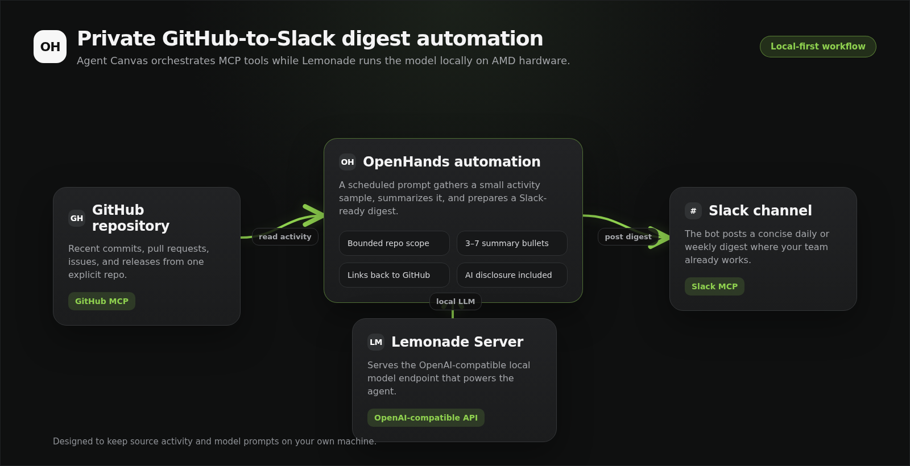
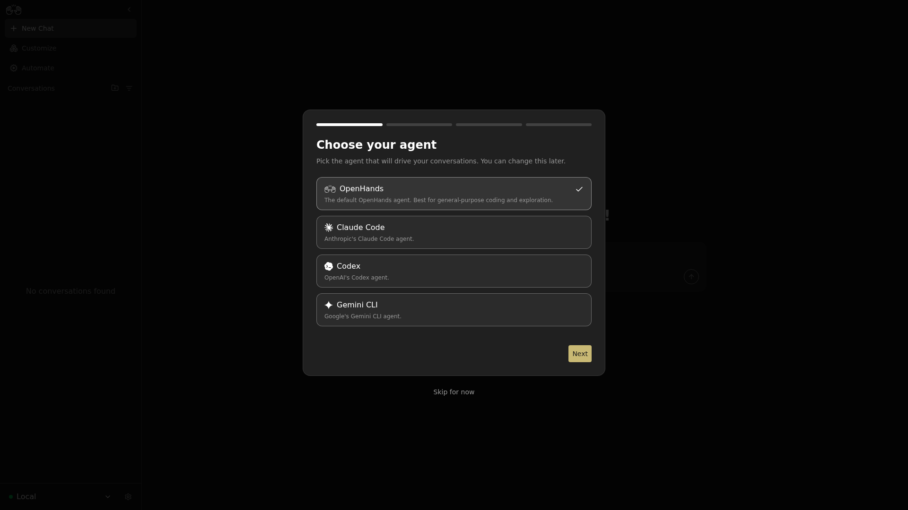
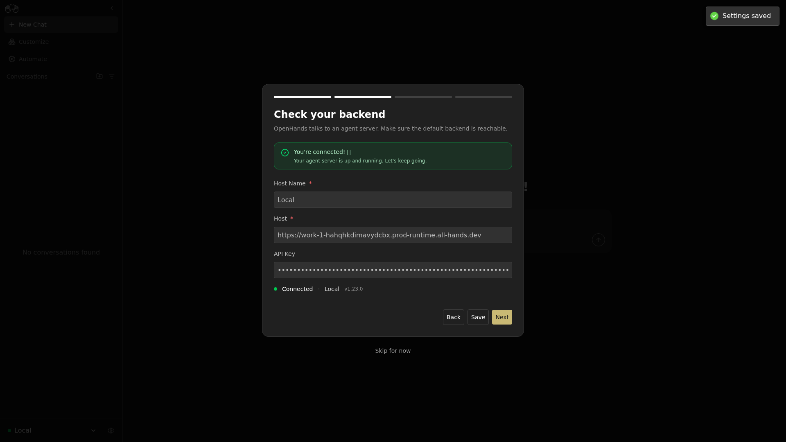
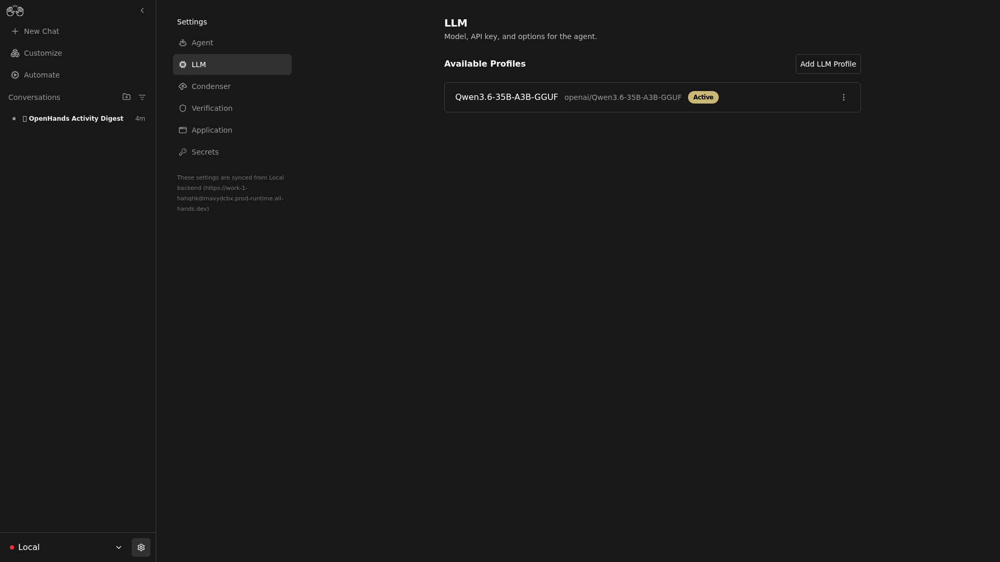
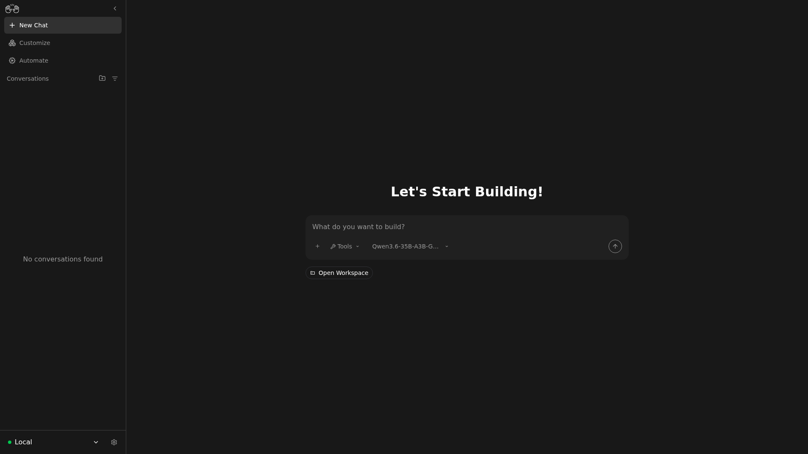
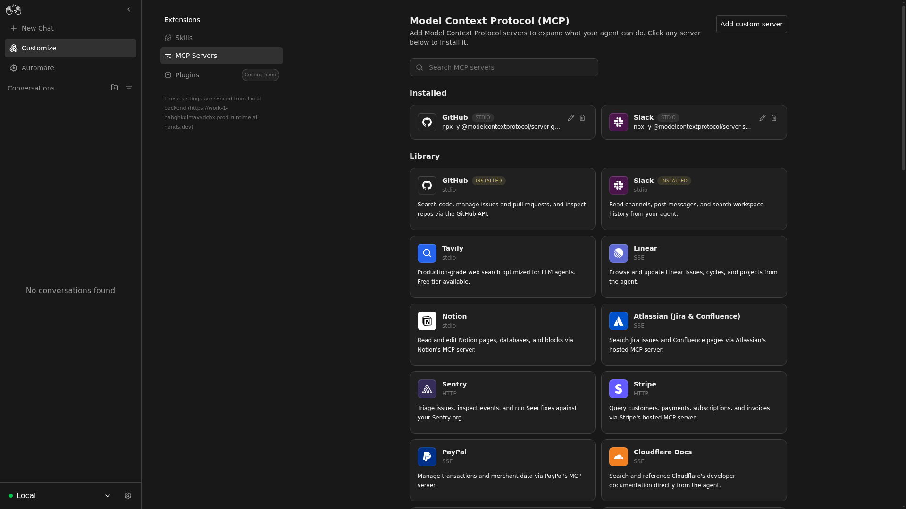
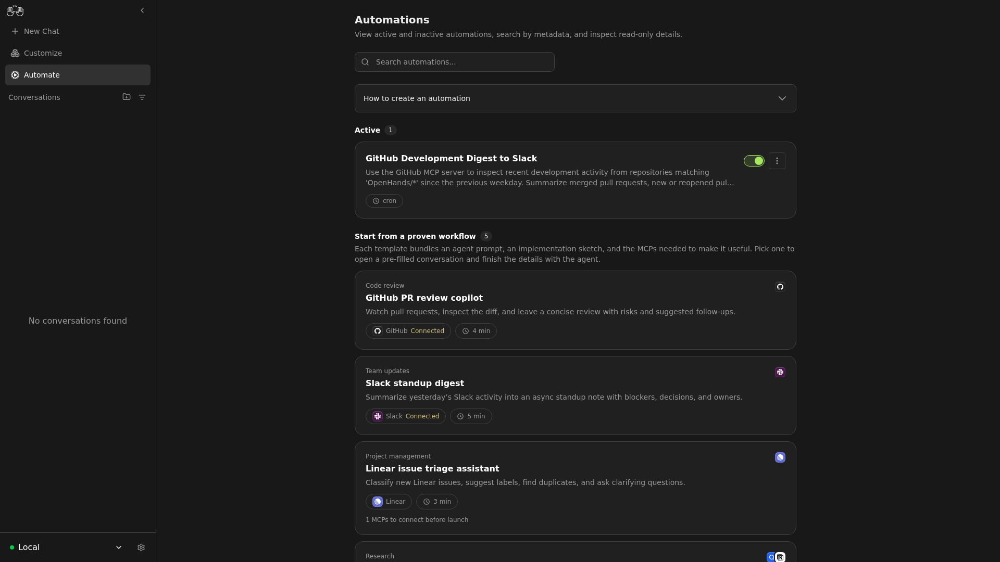
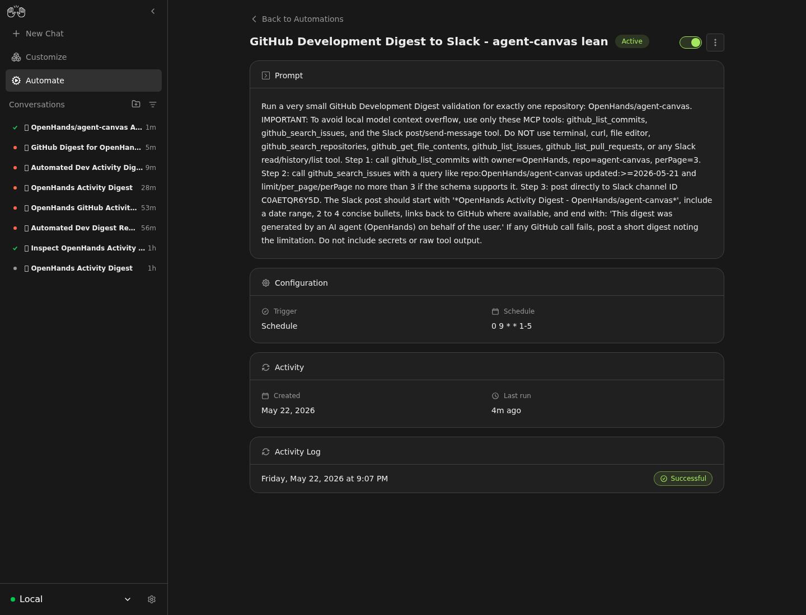
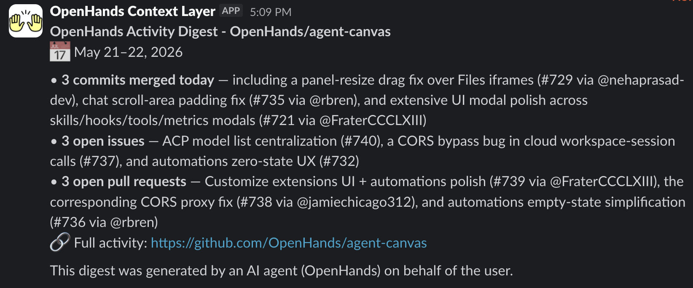

<!--
Copyright Advanced Micro Devices, Inc.

SPDX-License-Identifier: MIT
-->

<!-- @github-only -->
> [!IMPORTANT]
> This playbook uses AMD Playbooks comment tags that are interpreted by the
> AMD Playbooks site. GitHub renders the Markdown content, but not the device,
> OS, variable, or hidden-test directives.
<!-- @github-only:end -->

# Build a GitHub-to-Slack Development Digest with Agent Canvas and Lemonade

## Overview

Software engineering is full of repetitive tasks that still require context,
judgment, and careful follow-through. Automations are useful whenever a team
repeats the same context-gathering, decision, and notification loop: checking
activity, summarizing changes, triaging issues, monitoring health signals, or
posting updates. They reduce manual polling, make handoffs more consistent, and
let important work run on a schedule or in response to events.

[OpenHands automations](https://docs.openhands.dev/openhands/usage/automations/overview)
run these workflows as full agent conversations with access to your configured
LLM, stored secrets, tools, and integrations.
[Agent Canvas](https://github.com/OpenHands/agent-canvas) provides a local,
self-hostable UI for connecting an OpenHands agent server, configuring the LLM,
installing MCP servers, and creating or testing automations. Together, they make
it practical to assemble workflows that gather context, reason over it, and take
action without a developer manually repeating the same steps.

In this playbook, you will build one concrete automation: a scheduled
GitHub-to-Slack development digest powered by Agent Canvas, GitHub and Slack MCP
servers, and a local Lemonade model. Because the model runs locally through
Lemonade's OpenAI-compatible API, the workflow context and prompt stay on your
own AMD system.



<!-- @device:stx,krk -->
> [!NOTE]
> Coding-agent workflows benefit from a larger model and context window. Use at
> least 32 GB of system memory, and prefer 64 GB or more for larger GGUF models.
<!-- @device:end -->

## Prerequisites

<!-- @os:linux -->
<!-- @require:lemonade,nodejs -->
<!-- @os:end -->

<!-- @os:windows -->
<!-- @require:lemonade,nodejs -->
<!-- @os:end -->

You need:

- Lemonade Server installed.
- Agent Canvas checked out locally.
- A GitHub token with read access to the repository you want summarized.
- A Slack bot token (`xoxb-...`) with `chat:write` and channel read access.
- A Slack team ID (`T...`).
- A Slack channel ID (`C...`) where the digest should be posted.

Invite the Slack app to the target channel before testing the automation.

## Variables Used in This Playbook

<!-- @device:halo,halo_box,stx,krk -->
<!-- @var:id=lemonade_model value="Qwen3.6-35B-A3B-GGUF" -->
<!-- @device:end -->

```bash
export LEMONADE_BASE_URL="http://127.0.0.1:13305/api/v1"
export LEMONADE_MODEL="Qwen3.6-35B-A3B-GGUF"
export AGENT_CANVAS_URL="http://localhost:8000"
export AUTOMATION_API_URL="http://localhost:8000/api/automation"
export GITHUB_REPO_FILTER="your-org/your-repo"
export SLACK_DIGEST_CHANNEL="C0123456789"
export DIGEST_TIMEZONE="America/New_York"
```

Use an explicit `owner/repo` value for `GITHUB_REPO_FILTER`. Broad organization
wildcards can return too much MCP context for local models.

## 1. Start Lemonade Server

Start the model from the Lemonade CLI:

```bash
lemonade config set llamacpp.backend=vulkan
lemonade config set ctx_size=65536
lemonade run "${LEMONADE_MODEL}"
```

Lemonade exposes an OpenAI-compatible API at:

```text
http://127.0.0.1:13305/api/v1
```

<!-- @test:id=lemonade-version timeout=60 hidden=True -->
```bash
lemonade --version
```
<!-- @test:end -->

<!-- @test:id=lemonade-health-linux timeout=120 hidden=True -->
```bash
set -euo pipefail

for i in $(seq 1 120); do
  if curl -fsS "http://127.0.0.1:13305/api/v1/health" >/dev/null; then
    echo "OK: Lemonade Server is responding"
    exit 0
  fi
  sleep 1
done

echo "Lemonade Server did not become ready on http://127.0.0.1:13305"
exit 1
```
<!-- @test:end -->

## 2. Verify the Local Model

Confirm Lemonade can serve the selected model:

```bash
curl -s "${LEMONADE_BASE_URL}/models" | python3 -m json.tool
```

Then send a small chat request:

```bash
curl -sS "${LEMONADE_BASE_URL}/chat/completions" \
  -H "Content-Type: application/json" \
  -d '{
    "model": "'"${LEMONADE_MODEL}"'",
    "messages": [
      {"role": "user", "content": "Reply with exactly: OK"}
    ],
    "temperature": 0,
    "max_tokens": 64
  }' | python3 -m json.tool
```

If this returns a `choices` array, Lemonade is ready for Agent Canvas.

## 3. Start Agent Canvas with Automations

From the Agent Canvas checkout:

```bash
cd ~/work/agent-canvas
npm ci
npm run dev
```

Open Agent Canvas:

```text
http://localhost:8000
```

## 4. Complete the Onboarding Flow

Agent Canvas shows a first-run onboarding modal.

### Choose Agent

Select **OpenHands**.



### Check Backend

Confirm the local Agent Server is connected, then click **Next**.



### Set Up LLM

Open the advanced LLM settings and use:

| Field | Value |
| --- | --- |
| Custom model | `openai/Qwen3.6-35B-A3B-GGUF` |
| Base URL | `http://127.0.0.1:13305/api/v1` |
| API key | `lemonade` or your `LEMONADE_API_KEY` value |

The `openai/` prefix tells LiteLLM to use OpenAI-compatible request formatting
against the Lemonade endpoint. Click **Next** to save the profile.



### Finish Onboarding

Send the default hello message or continue to the home screen.



## 5. Install GitHub and Slack MCP Servers

Open the MCP directory:

```text
http://localhost:8000/mcp
```

Install **GitHub** and **Slack** from the marketplace. For a custom stdio setup,
use these values:

| Server | Field | Value |
| --- | --- | --- |
| GitHub | Command | `npx` |
| GitHub | Arguments | `-y @modelcontextprotocol/server-github` |
| GitHub | Environment | `GITHUB_PERSONAL_ACCESS_TOKEN=YOUR_GITHUB_TOKEN` |
| Slack | Command | `npx` |
| Slack | Arguments | `-y @modelcontextprotocol/server-slack` |
| Slack | Environment | `SLACK_BOT_TOKEN=xoxb-...` |
| Slack | Environment | `SLACK_TEAM_ID=T...` |
| Slack | Environment | `SLACK_CHANNEL_IDS=C0123456789` |

Set `SLACK_CHANNEL_IDS` to the digest channel ID so the agent does not need to
page through every Slack channel.



## 6. Create the GitHub-to-Slack Digest Automation

Open a new Agent Canvas conversation and paste this prompt. Replace the
repository, Slack channel ID, and timezone before sending.

```text
Create a scheduled OpenHands automation named "GitHub Development Digest to Slack".

Use the local OpenHands Automations prompt preset endpoint from the <RUNTIME_SERVICES>
block. The automation should:

1. Run every weekday at 9:00 AM in America/New_York.
2. Use the GitHub MCP server for exactly one repository: your-org/your-repo.
3. Keep GitHub lookups small: inspect the latest 3 to 5 commits, pull requests,
   issues, and releases. Do not search the whole organization or use wildcards.
4. Use the Slack MCP server to post directly to channel ID C0123456789.
5. Keep the Slack message concise: title with date range, 3 to 7 bullets,
   links back to GitHub, and a "Needs attention" section only if needed.
6. End with: "This digest was generated by an AI agent (OpenHands) on behalf of the user."
7. Do not include secrets, raw tokens, private environment variables, or unrelated Slack messages.

Use this trigger:
{
  "type": "cron",
  "schedule": "0 9 * * 1-5",
  "timezone": "America/New_York"
}

Use a timeout of 900 seconds.
```

The agent should return an automation ID. Save it:

```bash
export AUTOMATION_ID="PASTE_RETURNED_ID_HERE"
```



## 7. Test the Automation

Load the local automation API key:

```bash
export OPENHANDS_AUTOMATION_API_KEY="$(cat ~/.openhands/agent-canvas/automation-api-key.txt)"
```

Run the automation once:

```bash
curl -sS -X POST "${AUTOMATION_API_URL}/v1/${AUTOMATION_ID}/dispatch" \
  -H "Authorization: Bearer ${OPENHANDS_AUTOMATION_API_KEY}" \
  -H "Content-Type: application/json" \
  -d '{}' | python3 -m json.tool
```

Check the run status:

```bash
curl -sS "${AUTOMATION_API_URL}/v1/${AUTOMATION_ID}/runs?limit=5" \
  -H "Authorization: Bearer ${OPENHANDS_AUTOMATION_API_KEY}" | python3 -m json.tool
```

You should see the latest run transition to `COMPLETED`, and the target Slack
channel should contain the digest.





## Troubleshooting

- **Agent Canvas cannot reach Lemonade:** verify `curl -fsS "${LEMONADE_BASE_URL}/health"`
  and confirm the base URL in the LLM profile matches Lemonade.
- **Slack can read channels but cannot post:** invite the Slack app to the target
  channel and confirm the bot has `chat:write`.
- **The automation lists too many channels:** use a Slack channel ID and set
  `SLACK_CHANNEL_IDS` on the Slack MCP server.
- **The automation exceeds context:** use an explicit repository, cap GitHub
  result sets to 3 to 5 items, and create a new prompt automation after changing
  from a broad repo filter to a narrow one.

## Next Steps

- Add a weekly release-only digest.
- Add a GitHub event-triggered automation for faster PR or push alerts.
- Route the same digest into Notion, Linear, or another MCP-backed tool.

## Resources

- [AMD AI Playbooks](https://developer.amd.com/playbooks/)
- [Lemonade Server documentation](https://lemonade-server.ai/docs)
- [OpenHands extensions repository](https://github.com/OpenHands/extensions)
- [Model Context Protocol servers](https://github.com/modelcontextprotocol/servers)
- [Slack MCP package](https://www.npmjs.com/package/@modelcontextprotocol/server-slack)
